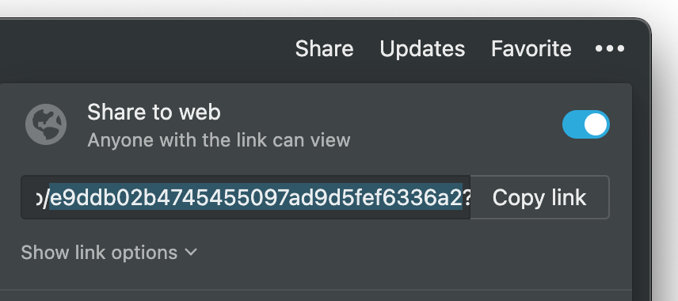

# notion-exporter

Notion Exporter is a github action to export the content of your Notion pages to a github repo.

## Demo

See [`notion-exporter-demo`](https://github.com/igor-kupczynski/notion-exporter-demo).

## How does it work?

The action relies on the [notion export feature](https://www.notion.so/Export-a-page-as-Markdown-69b6031dd9454022abed8e23a86b0e1e). To call it programmatically we rely on the unofficial [notion API go client](https://www.notion.so/Export-a-page-as-Markdown-69b6031dd9454022abed8e23a86b0e1e).

## Usage

Example workflow: [`export-notion.yml`](https://github.com/igor-kupczynski/notion-exporter-demo/blob/main/.github/workflows/export-notion.yml).

```yaml
name: Export notion pages from the test workspace

on:
  schedule:
    - cron: "0 */6 * * *"  # Call the export every 6 hours
  workflow_dispatch: {}

jobs:
  export:
    runs-on: ubuntu-latest
    steps:
      - uses: igor-kupczynski/notion-exporter@v1
        with:
          pages: page-id,other-page-id
          output-dir: notion-backup
          notion-token: ${{ secrets.NOTION_TOKEN }}
          github-token: ${{ secrets.GITHUB_TOKEN }}
```

## Inputs

### `pages`

Comma-separated list of page to export the data from.

E.g. `e9ddb02b4745455097ad9d5fef6336a2,e65ccf14e13b48d1a6d1b14cd84c4bed`.

You can get the page IDs from the **Share** menu in Notion.

Say the web link is `https://www.notion.so/e9ddb02b4745455097ad9d5fef6336a2?v=530e3734d3ef461c76fcc349e28b7b7a`, then your page ID is `e9ddb02b4745455097ad9d5fef6336a2`.

The page can be private.




### `github-token`

Github token to use to commit to the repo. Most of the time we can pass the default github action token:
```yaml
github-token: ${{ secrets.GITHUB_TOKEN }}
```
  
### `notion-token`

Value of the `token_v2` cookie.

You can grab it from your web browser. E.g. in chrome:
1. Log-in to notion and go to your workspace.
2. Open developer tools: **Menu** --> **More Tools** -> **Developer Tools**
3. Go to **Application** tab 
4. Go tp **Storage** -> **Cookies**
5. Copy the value of `token_v2` cookie


### `output-dir`

Directory under your repo to sync the data to.

🔥🔥🔥 Note the existing content of the directory will be deleted, use with care.

In the demo we set it to [`notion-backup`](https://github.com/igor-kupczynski/notion-exporter-demo/tree/main/notion-backup).

### (optional) `branch`

The branch to use, if not provided then it defaults to `main`.
